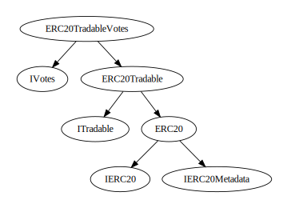
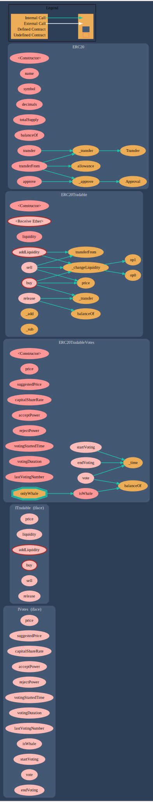

# Redduck Milestone 1

## Sūrya's Description Report

### Files Description Table

| File Name                                | SHA-1 Hash                               |
| ---------------------------------------- | ---------------------------------------- |
| ./contracts/interfaces/IVotes.sol        | c1d09e7d196f18b1e36fe0e8ac2e8c31d4c1ecaf |
| ./contracts/interfaces/ITradable.sol     | 0c8b2eafdf527158560c95fd1f4f46308e44a1a2 |
| ./contracts/ERC20/ERC20TradableVotes.sol | 0036e716f172a3dfda1fdedc65b8b8a9c5ba8b23 |
| ./contracts/ERC20/ERC20Tradable.sol      | 5abfa541af05e8d0062949db1afb1bfe14fa8bbe |
| ./contracts/ERC20/ERC20.sol              | d086ee7586227db6e12fe88c02429781237d5ec6 |

### Contracts Description Table

|        Contract        |       Type        |         Bases          |                |               |
| :--------------------: | :---------------: | :--------------------: | :------------: | :-----------: |
|           └            | **Function Name** |     **Visibility**     | **Mutability** | **Modifiers** |
|                        |                   |                        |                |               |
|       **IVotes**       |     Interface     |                        |                |               |
|           └            |       price       |      External ❗️      |                |     NO❗️     |
|           └            |  suggestedPrice   |      External ❗️      |                |     NO❗️     |
|           └            | capitalShareRate  |      External ❗️      |                |     NO❗️     |
|           └            |    acceptPower    |      External ❗️      |                |     NO❗️     |
|           └            |    rejectPower    |      External ❗️      |                |     NO❗️     |
|           └            | votingStartedTime |      External ❗️      |                |     NO❗️     |
|           └            |  votingDuration   |      External ❗️      |                |     NO❗️     |
|           └            | lastVotingNumber  |      External ❗️      |                |     NO❗️     |
|           └            |      isWhale      |      External ❗️      |                |     NO❗️     |
|           └            |    startVoting    |      External ❗️      |       🛑       |     NO❗️     |
|           └            |       vote        |      External ❗️      |       🛑       |     NO❗️     |
|           └            |     endVoting     |      External ❗️      |       🛑       |     NO❗️     |
|                        |                   |                        |                |               |
|     **ITradable**      |     Interface     |                        |                |               |
|           └            |       price       |      External ❗️      |                |     NO❗️     |
|           └            |     liquidity     |      External ❗️      |                |     NO❗️     |
|           └            |   addLiquidity    |      External ❗️      |       💵       |     NO❗️     |
|           └            |        buy        |      External ❗️      |       💵       |     NO❗️     |
|           └            |       sell        |      External ❗️      |       🛑       |     NO❗️     |
|           └            |      release      |      External ❗️      |       🛑       |     NO❗️     |
|                        |                   |                        |                |               |
| **ERC20TradableVotes** |  Implementation   | IVotes, ERC20Tradable  |                |               |
|           └            |   <Constructor>   |       Public ❗️       |       🛑       | ERC20Tradable |
|           └            |       price       |       Public ❗️       |                |     NO❗️     |
|           └            |  suggestedPrice   |       Public ❗️       |                |     NO❗️     |
|           └            | capitalShareRate  |       Public ❗️       |                |     NO❗️     |
|           └            |    acceptPower    |       Public ❗️       |                |     NO❗️     |
|           └            |    rejectPower    |       Public ❗️       |                |     NO❗️     |
|           └            | votingStartedTime |       Public ❗️       |                |     NO❗️     |
|           └            |  votingDuration   |       Public ❗️       |                |     NO❗️     |
|           └            | lastVotingNumber  |       Public ❗️       |                |     NO❗️     |
|           └            |      isWhale      |       Public ❗️       |                |     NO❗️     |
|           └            |    startVoting    |      External ❗️      |       🛑       |   onlyWhale   |
|           └            |       vote        |      External ❗️      |       🛑       |   onlyWhale   |
|           └            |     endVoting     |      External ❗️      |       🛑       |     NO❗️     |
|           └            |      \_time       |      Internal 🔒       |                |               |
|                        |                   |                        |                |               |
|   **ERC20Tradable**    |  Implementation   |    ITradable, ERC20    |                |               |
|           └            |   <Constructor>   |       Public ❗️       |       🛑       |     ERC20     |
|           └            |  <Receive Ether>  |      External ❗️      |       💵       |     NO❗️     |
|           └            |       price       |       Public ❗️       |                |     NO❗️     |
|           └            |     liquidity     |       Public ❗️       |                |     NO❗️     |
|           └            |   addLiquidity    |      External ❗️      |       💵       |     NO❗️     |
|           └            |        buy        |      External ❗️      |       💵       |     NO❗️     |
|           └            |       sell        |      External ❗️      |       🛑       |     NO❗️     |
|           └            |      release      |      External ❗️      |       🛑       |     NO❗️     |
|           └            | \_changeLiquidity |      Internal 🔒       |       🛑       |               |
|           └            |       \_add       |       Private 🔐       |                |               |
|           └            |       \_sub       |       Private 🔐       |                |               |
|                        |                   |                        |                |               |
|       **ERC20**        |  Implementation   | IERC20, IERC20Metadata |                |               |
|           └            |   <Constructor>   |       Public ❗️       |       🛑       |     NO❗️     |
|           └            |       name        |       Public ❗️       |                |     NO❗️     |
|           └            |      symbol       |       Public ❗️       |                |     NO❗️     |
|           └            |     decimals      |       Public ❗️       |                |     NO❗️     |
|           └            |    totalSupply    |       Public ❗️       |                |     NO❗️     |
|           └            |     balanceOf     |       Public ❗️       |                |     NO❗️     |
|           └            |     transfer      |       Public ❗️       |       🛑       |     NO❗️     |
|           └            |     allowance     |       Public ❗️       |                |     NO❗️     |
|           └            |      approve      |       Public ❗️       |       🛑       |     NO❗️     |
|           └            |   transferFrom    |       Public ❗️       |       🛑       |     NO❗️     |
|           └            |     \_approve     |      Internal 🔒       |       🛑       |               |
|           └            |    \_transfer     |      Internal 🔒       |       🛑       |               |

### Legend

| Symbol | Meaning                   |
| :----: | ------------------------- |
|   🛑   | Function can modify state |
|   💵   | Function is payable       |

## Inheritance graph

## Call graph

